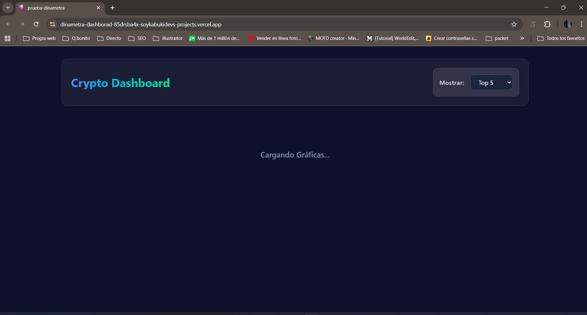
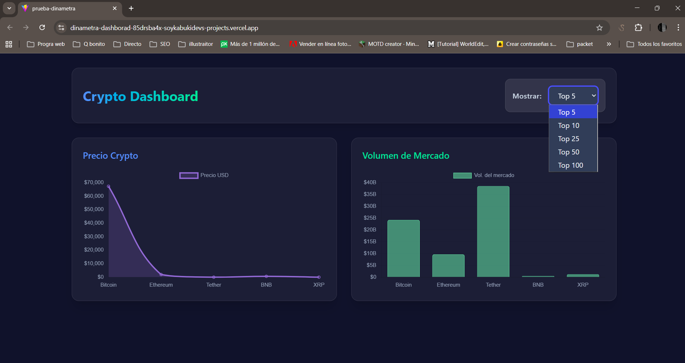
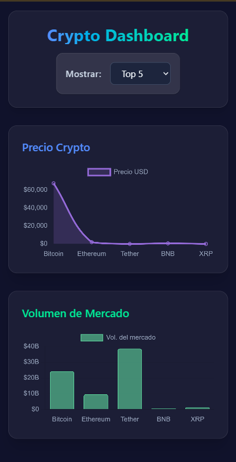

# Crypto Dashboard Dinametra

Un dashboard interactivo que visualiza datos en tiempo real de criptomonedas utilizando la API pública de **CoinLore**.

## Características

- **Visualización de Datos:** Gráficos de línea para precios y de barras para volumen de mercado usando `Chart.js` y `react-chartjs-2`.
- **Filtros Dinámicos:** Selector para consultar el **Top 5, 10, 25, 50, o 100** de criptomonedas con actualización inmediata.
- **Diseño Responsivo:** Creado íntegramente con **Tailwind CSS**. Presenta un moderno estilo *Glassmorphism* y Dark Mode.
- **Calidad del Código y Arquitectura:** Estructura modular, separando responsabilidades vía Custom Hooks para *data-fetching*, servicios para la API, y componentes UI presentacionales puros.
- **Accesibilidad:** Uso de directivas ARIA para el uso conveniente mediante lectores de pantalla y navegación por teclado.
- **Testing:** Entorno configurado con Vitest y React Testing Library garantizando la renderización y funcionamiento correcto de los componentes críticos.

## Instrucciones de Instalación

1. Clonar el repositorio.
2. Asegurar que tienes Node.js instalado.
3. Instalar las dependencias en la raíz del proyecto:
   ```bash
   npm install
   ```
4. Levantar el servidor de desarrollo Vite:
   ```bash
   npm run dev
   ```

## 🚀 Demostración en Vivo

Puedes ver el proyecto desplegado y funcionando aquí:  
[**Ver Demo en Vivo en Vercel**](https://dinametra-dashborad.vercel.app?_vercel_share=o4lbQpmGMzLbQCrwvyHhiR4BDt2OoeAD)

## Capturas de Pantalla

- 
- 
- 

## Ejecución de Pruebas

Para correr las pruebas unitarias usando Vitest:
```bash
npm run test
```

## Enfoque Adoptado

- **Gestión de Estado y Ciclo de Vida**: Se utiliza un Custom Hook (`useCryptoData`) dedicado a la obtención de datos para evitar re-renderizaciones innecesarias. Se añadió el patrón `isMounted` en el hook local para evitar fugas de memoria o actualizaciones de estado después de que un componente haya sido desmontado. 
- **Optimización y Prevención de Errores (CoinLore API)**: Se migró finalmente a **CoinLore API** para garantizar la máxima estabilidad y evitar los bloqueos persistentes de DNS/CORS de CoinGecko y CoinCap en entornos de producción como Vercel. Se implementó una capa de mapeo de datos para mantener la consistencia visual.
- **Componentes Ciegos (*Dumb Components*)**: Los componentes `ChartPrice` y `ChartVolume` se transformaron en componentes de presentación que reciben toda su data por "props", y delegan la lógica de *fetch* al `Dashboard` que actúa como contenedor principal. Esto mejora mucho el rendimiento. Además utilizan funciones nativas de JS (`Intl.NumberFormat`) para formatear los números gigantes en monedas y billones entendibles.
- **Herramientas Modernas**: Vite sobre React para rapidez al codificar, renderizado responsivo con **Tailwind CSS v4** mediante clases utilitarias aplicando *Glassmorphism*, y reemplazo del entorno antiguo de Jest por **Vitest + React Testing Library** interactuando directamente sobre simulaciones del DOM de usuario.

## Posibles Mejoras a Futuro
- Manejar la paginación para expandir infinitamente la cantidad de datos que provee la API libre de CoinLore de forma optimizada.
- Internacionalización (i18n).
